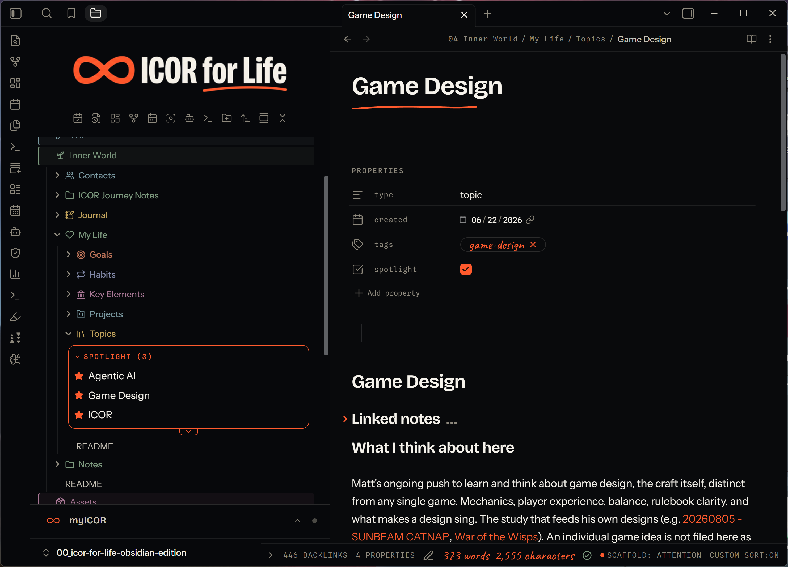
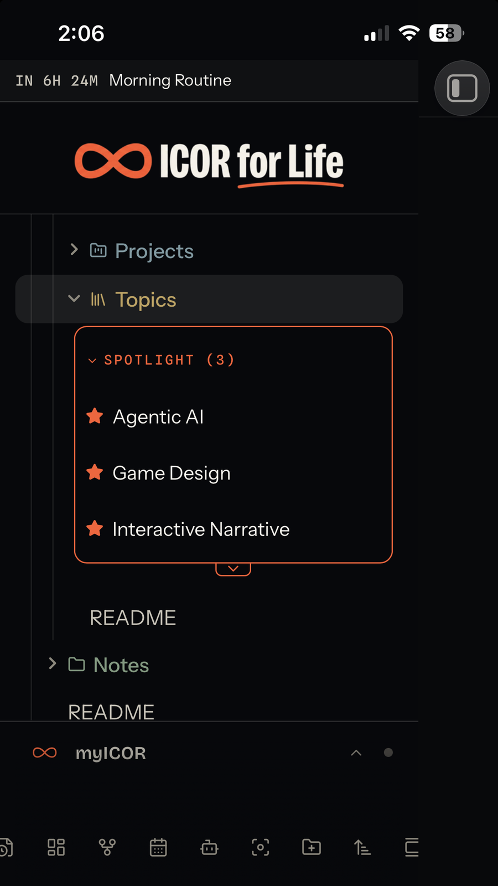
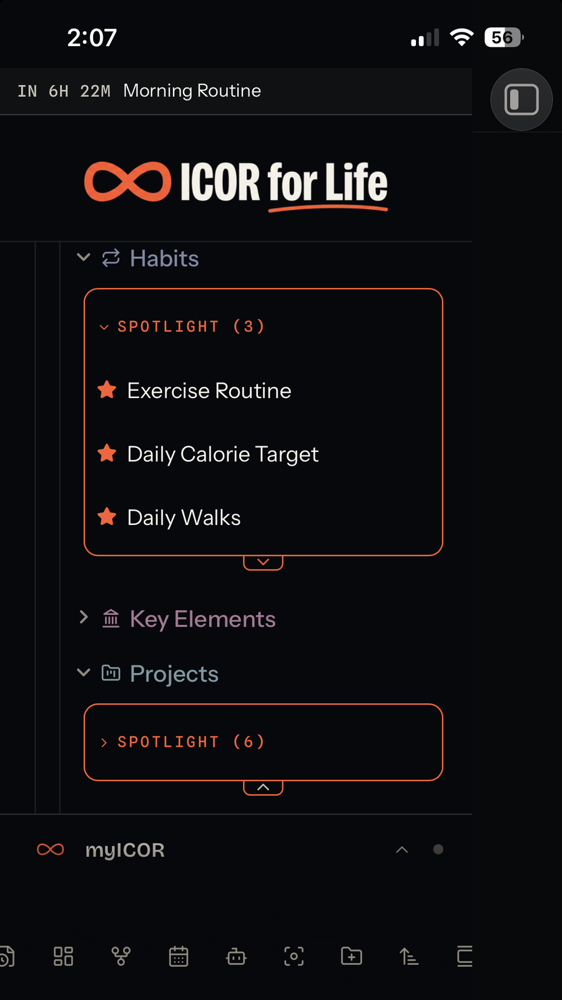

# Spotlight


Star a note, folder, or file, and it surfaces on its own shelf at the top
of that branch in Obsidian's file explorer — without moving anything on
disk.

Spotlight watches one or more folders you choose ("roots"). Inside a
root, you can star:

* any Markdown note,
* any subfolder (if you turn on "Spotlight folders too" for that root), and
* any other file — an image, a PDF, a `.base`, a `.canvas`, anything.

A starred item keeps living exactly where it already is. Spotlight adds
a small "SPOTLIGHT (n)" shelf above the root's normal contents, listing
everything starred underneath it. Click a shelf row to reveal and open
the real item; click its star to un-star it. Nothing is copied, moved,
or duplicated — the shelf is a second way to see items that are already
there, allowing you to focus on, or Spotlight, specific items.

## Built for ICOR for Life, works anywhere

This plugin was built primarily for the ICOR for Life Obsidian scaffold (https://www.myicor.com),
and it's ICOR-aware: on a fresh install, it checks
whether the vault is actually running that scaffold (by reading its own
`.icor-for-life/manifest.json`), and
if so, it seeds one root for each of the five "My Life" areas that
already exist in that vault — Goals, Habits, Key Elements, Projects, and
Topics.

But you don't need to be using ICOR for Life to use Spotlight. In any other vault
— or once you're past the fresh-install seeding — a root is just a
folder path you type into the settings tab. Point it at anything:
a work-in-progress folder, a project folder, your whole vault. Add as
many roots as you like; remove or disable any of them at any time.

## Installation

**Not yet on the Obsidian community plugin list.** Submission is
planned; until it's approved, install it one of these ways:

**Via** [**BRAT**](https://github.com/TfTHacker/obsidian42-brat) (Beta
Reviewers Auto-update Tool):

1. Install and enable the BRAT community plugin.
2. In BRAT's settings, "Add a beta plugin", and paste this repository's
URL.
3. Enable Spotlight under Community plugins.

**Manually:**

1. Download `main.js`, `manifest.json`, and `styles.css` from the
[latest release](../../releases/latest).
2. Create a folder named `spotlight` inside your vault's
`.obsidian/plugins/` folder, and put the three files there.
3. Reload Obsidian (or disable/re-enable community plugins), then enable
Spotlight under Settings → Community plugins.

## How it works

**Roots.** A root is a folder path, with one on/off switch. Roots can't
nest inside or overlap each other — Spotlight refuses an add or an edit
that would create that. A disabled root's shelf disappears but its
settings are kept.

**What's starrable, and where the star lives.**

|Kind|Starrable when|Star stored in|
|-|-|-|
|Markdown note|always, under any enabled root|that note's own frontmatter, `spotlight: true`|
|Folder|the root's "Spotlight folders too" toggle is on|the plugin's own `data.json`|
|Any other file|always|the plugin's own `data.json`|

A note's star lives in the note itself — it's just a YAML frontmatter
key, so it travels with the note (copy the note anywhere, sync it,
whatever) and shows up in a normal frontmatter search. Un-starring a
note removes the `spotlight:` key entirely rather than setting it to
`false`, so a note that's never been starred stays untouched. Writing
that key edits the frontmatter block's raw text directly, rather than
using Obsidian's higher-level frontmatter API, specifically to preserve
the rest of your YAML exactly as you wrote it — comments, key order,
quote style — instead of having the whole block reparsed and
reserialized for a one-key change. A folder's
or a file's star has nowhere similar to live (a folder carries no
frontmatter), so those go into the plugin's own `data.json` under
`starredPaths` instead — which means folder and file stars are local to
this copy of the plugin unless your vault as a whole (including
`.obsidian/plugins/`) is what you're syncing. `data.json` also holds
which shelves and branches you've collapsed or hidden, and the roots
list itself — none of that is vault content, so none of it syncs unless
your plugin folder does.

**The shelf.** Each enabled root gets its own shelf, showing every
starred item under it (notes, folders, and files, all mixed together).
Click a row to reveal the real
item in the tree and open it; click the star on a row to un-star
directly from the shelf. The shelf's own header collapses/expands the
list. A separate small tab on the shelf's bottom edge hides or shows
everything below it — the real folder tree for that root — useful when
you only want the curated shelf visible and don't need to browse the
raw contents underneath.



The star you see in the note's own properties above — `spotlight` ticked on — is the whole mechanism for a note: no separate database, just that one frontmatter key.

**Renames and deletes.** Moving or renaming a starred item, or a
configured root, inside Obsidian keeps its star and its settings
attached. A change made outside Obsidian (vault closed, another synced
device, a sync client that hasn't caught up yet) isn't seen by those
listeners, so a star can go stale — the settings tab has a "Remove stars
for missing files" button for that, which only ever runs when you click
it, never automatically (so a temporarily-offline synced file is never
mistaken for a deletion).

## Settings reference

**Add a directory** — type a folder path and click Add.
Refused if the path is already covered by, or would nest inside/around,
an existing root.

**Active directories** — one card per configured root:

* **Toggle** — track this root or not.
* **Trash icon** — remove this root from settings. A note's own
frontmatter star is untouched either way. A folder's or file's star
under this root, stored in `data.json`, is left in place rather than
deleted — it simply stops showing (no shelf, no visible star) until
either the same root is added back, or the starred item itself is
later deleted, at which point "Remove stars for missing files" (below)
will clear it.
* **Folder path** — editable in place; committed on blur or Enter.
* **Counts** — how many candidates and how many are currently starred,
or a warning if the path doesn't currently exist in the vault.
* **Spotlight folders too** — lets subfolders under this root be starred
and shelved too (folders are always walked and shown normally either
way; this only controls whether a folder itself can carry a star).

**Clean up stale stars** — removes stars kept for files/folders that no
longer exist in the vault. Shows a live count; does nothing when there's
nothing to clean.

**Auto-reveal active file** — reports whether Obsidian's own "auto-reveal
active file" is on for an open file explorer pane, with a one-way "Turn
off" button. Spotlight doesn't turn it on or manage it otherwise; this
is here because auto-reveal can scroll the file explorer toward a note
that's inside a branch you've hidden with the shelf's own hide toggle
(above), and Spotlight has no way to prevent that itself.

## Theming

Every color, size, and spacing Spotlight draws is a CSS custom property,
so a theme or a CSS snippet can restyle it without touching the plugin.
The main ones:

```css
--spotlight-marker        /\* the core accent color — defaults to your theme's own accent \*/
--spotlight-accent        /\* an alias of --spotlight-marker; the shelf border (--spotlight-fence) reads this one \*/
--spotlight-marker-soft   /\* soft background tint for a starred/hovered row, derived from the accent \*/
--spotlight-star-rest     /\* unstarred star color \*/
--spotlight-star-hover    /\* star color on hover \*/
--spotlight-fence         /\* the shelf's border color \*/
--spotlight-fence-width   /\* the shelf's border width \*/
--spotlight-radius        /\* corner radius used across shelf/pill elements \*/
--spotlight-header-text   /\* the "SPOTLIGHT (n)" header's text color \*/
--spotlight-header-font   /\* the header's font \*/
--spotlight-header-size   /\* the header's font size \*/
--spotlight-kicker-tracking /\* letter-spacing on the header label \*/
--spotlight-hover-bg      /\* row hover background \*/
--spotlight-pill-tint     /\* the directory pill's background tint (settings tab) \*/
--spotlight-pill-height   /\* the directory pill's height \*/
--spotlight-pill-radius   /\* the directory pill's corner radius \*/
```

By default these derive from your theme's own accent and background
tokens, so Spotlight should look at home in most themes with no snippet
needed.

## Known limits and conflicts

* **Mobile is supported**, tested on iPhone and iPad. A few things work
differently there: long-press a shelf row to remove it (there is no
right-click), a "Star or unstar this note" command is available for
Obsidian's mobile toolbar, and the shelf's tap targets are larger.
Desktop looks and behaves exactly as before.

* **Depends on Obsidian's internal file-explorer structure, not only its
public API.** The shelf is drawn directly into the file explorer's own
internal row structure (its per-file DOM elements and its virtualized
list), which Obsidian doesn't document or guarantee as stable, plus one
specific undocumented method (`revealInFolder()`, used to scroll to and
highlight a row when you click a shelf item — called behind a
feature-detection guard, so its removal degrades to "opens the note
without the scroll/highlight" rather than an error). A future Obsidian
release that reworks the file explorer internally could break the
shelf until this plugin is updated to match.
* **A star can go stale if a starred item is moved, renamed, or deleted
outside Obsidian** — while the vault is closed, from another synced
device, or before a sync client has caught up. Spotlight only learns
about renames and deletes through Obsidian's own vault events, so a
change made outside those events isn't detected until you run
"Remove stars for missing files" yourself in Settings. This is
deliberate: automatically pruning on every load would risk deleting a
real star for a file that's simply still syncing down.
* **Iconize** (`obsidian-icon-folder`) — set its custom icons *before*
starring a row, or disable Spotlight while assigning them. Iconize
decides whether to draw an icon based on how many child elements a row
already has; once Spotlight has added its star element to a row (even
after un-starring), that row's child count no longer matches what
Iconize expects, and an icon assigned afterward won't render. Spotlight
checks whether Iconize is enabled (through Obsidian's own installed-plugin
list) and shows a notice about this once per session.
* **Stock/default accent colors can fail contrast on some Spotlight
elements.** The directory pill and a few other elements read your
theme's own accent color at a modest opacity; a theme (or Obsidian's
own default purple accent at certain lightness values) can land under
the WCAG AA 4.5:1 text-contrast floor at that opacity, with no tint
value that fixes it for every possible accent. This is a property of
the theme's own accent, not something Spotlight's CSS alone can
guarantee against — override the relevant token (see Theming, above)
if you hit this.

On mobile:

 

## Development

No build step — `main.js` is hand-written CommonJS, and it's exactly
what Obsidian loads. Edit it directly.

```bash
npm test
```

runs the plugin's test suite (Node's built-in test runner, no
dependencies to install) against a small stub of the `obsidian` module,
covering settings, discovery/classification, the storage layer, and the
file-explorer integration logic.

See `CONTRIBUTING.md` before opening a pull request.

## Credits

Built by Matt Zymet ([@zymetm](https://github.com/zymetm)).

Not affiliated with or endorsed by ICOR for Life or Paperless Movement.
"ICOR for Life" refers to a separate, independently maintained Obsidian
vault scaffold; this plugin only reads that scaffold's own small
machine-readable manifest file to detect whether it's installed, and
reproduces none of that suite's own code.

## License

[MIT](LICENSE) © 2026 Matt Zymet

